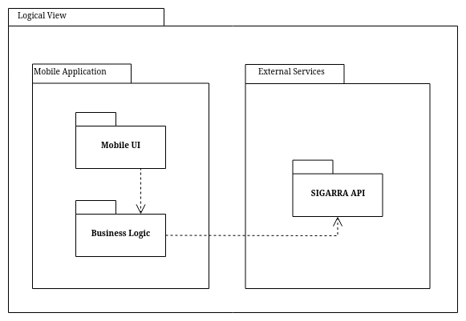
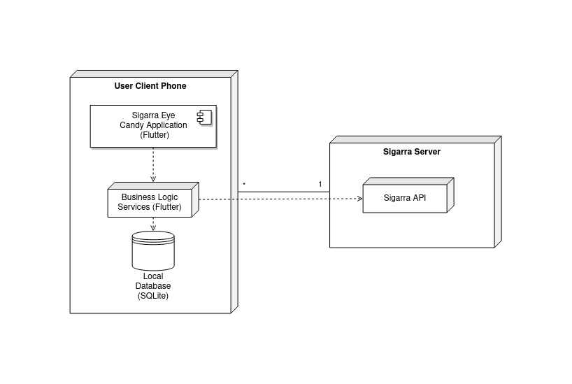

# Architecture and Design

In this section, the logical and physical architecture of the system are detailed, as well as description of the vertical prototype implemented.

Our project is divided into 3 main sections:

- The GUI, which the user will interact with when using the app
- A Controller with the business logic related to translating the users requests into API calls, as well as interfacing with the SIGARRA API
- And the SIGARRA API, as an external dependency, being the repository where the data is held.

A slight variation of the MVC pattern will be followed, with the Model being possibly added in future features, since this pattern gives us good separation of concerns, as well as good decoupling between all sections of the system.

### Logical architecture

This subsection intends to highlight the high-level logical structure of the code, using the following UML package diagram.

The following components exist:

- The Mobile UI encompasses what the user will see and interact with, in the mobile application.
- The Business Logic will handle requests from the client and translate them into requests to the API, and perform any other necessary procedure.
- Finally, in the External Services category lies the SIGARRA API, from where all the data will be fetched and requested.

### Physical architecture

This subsection intends to document the high-level physical structure of the software system.

The components described are as follows:

- The Sigarra Eye Candy Application represents the majority of the features of our application the user will interact with. This application will be developed using the Flutter framework.
- The business logic will handle the Application requests performed by its user, and make requests to the Sigarra API.
- The Sigarra API is responsible for receiving our requests and managing them appropriately.

### Vertical prototype

For our vertical prototype, we have implemented the following:

- Basic home page
- Card list
