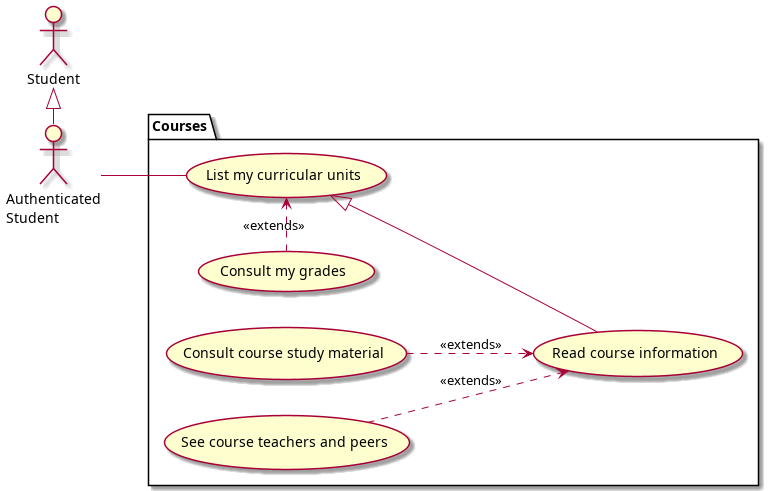

# Requirements

In this section, functional and non-functional requirements for our product are described.

## Use case model

Our application use cases reflect the tasks the user needs to be able to accomplish using the system, namely to authenticate himself and consult course information and material.

  

|                                    |                                                                                                                                                                                                                                                                                                                     |
| ---------------------------------- | ------------------------------------------------------------------------------------------------------------------------------------------------------------------------------------------------------------------------------------------------------------------------------------------------------------------- |
| _Name_                             | Login                                                                                                                                                                                                                                                                                                               |
| _Actor_                            | Student                                                                                                                                                                                                                                                                                                             |
| _Description_                      | The Student authenticates into the system, entering his SIGARRA credentials (student number and password), in order to access the UNI features                                                                                                                                                                      |
| _Preconditions_                    | - The Student is registered into SIGARRA                                                                                                                                                                                                                                                                            |
| _Postconditions_                   | - The Student enters the app, having access to it's full features.                                                                                                                                                                                                                                                  |
| _Normal flow_                      | 1. The Student accesses the app.  2. The system shows the Login screen   3. The Student enters his SIGARRA credentials   4. If wanted, the Student may choose to keep his session on.  5. The system verifies the credentials.  6. If they match, the system redirects the Student to the main page. |
| _Alternative flows and exceptions_ | 1. [Error entering credentials] If, in step 5 of the normal flow the system detects flaws, the system remains in the login page, and highlights the problem.                                                                                                                                                        |

|                                    |                                                                                                                                                                                             |
| ---------------------------------- | ------------------------------------------------------------------------------------------------------------------------------------------------------------------------------------------- |
| _Name_                             | Logout                                                                                                                                                                                      |
| _Actor_                            | Authenticated Student                                                                                                                                                                       |
| _Description_                      | The Student logs out of the system, if he decides his session in UNI should be terminated                                                                                                   |
| _Preconditions_                    | - The Student is registered into SIGARRA   - The Student is authenticated in the UNI app                                                                                                 |
| _Postconditions_                   | - The Student leaves the app, no longer having access to it's full features.                                                                                                                |
| _Normal flow_                      | 1. The Student accesses the settings section.  2. The system shows the Settings screen   3. The Student presses the logout button   4. The system logs the user out of the system. |
| _Alternative flows and exceptions_ | There are no foreseeable exceptions to this use case                                                                                                                                        |

|                                    |                                                                                                                                                                                                                                       |
| ---------------------------------- | ------------------------------------------------------------------------------------------------------------------------------------------------------------------------------------------------------------------------------------- |
| _Name_                             | List my curricular units                                                                                                                                                                                                              |
| _Actor_                            | Authenticated Student                                                                                                                                                                                                                 |
| _Description_                      | The Authenticated Student lists the curricular units he's enrolled in.                                                                                                                                                                |
| _Preconditions_                    | - The Student is registered into SIGARRA   - The Student is authenticated in the UNI app                                                                                                                                           |
| _Postconditions_                   | - The Student sees a list of curricular units he's enrolled in.                                                                                                                                                                       |
| _Normal flow_                      | 1. The Student accesses his curricular units section.  2. The system gathers the curricular units the Student is enrolled in.   3. The system displays the gathered curricular units on the Student's curricular units section. |
| _Alternative flows and exceptions_ | 1. [The Student is not enrolled in any curricular units]If, in step 2 of the normal flow of the system, the Authenticated Student is not enrolled in any curricular units, an appropriate message will me displayed.                  |

|                                    |                                                                                                                                                                                                                                                    |
| ---------------------------------- | -------------------------------------------------------------------------------------------------------------------------------------------------------------------------------------------------------------------------------------------------- |
| _Name_                             | Consult my grades                                                                                                                                                                                                                                  |
| _Actor_                            | Authenticated Student                                                                                                                                                                                                                              |
| _Description_                      | The Student consults his grades on the curricular units he's enrolled in.                                                                                                                                                                          |
| _Preconditions_                    | - The Student is registered into SIGARRA   - The Student is authenticated in the UNI app                                                                                                                                                        |
| _Postconditions_                   | - The Student sees a list of grades for the curricular units he's enrolled in.                                                                                                                                                                     |
| _Normal flow_                      | 1. The Student accesses his curricular units section.  2. The system gathers the grades for the curricular units the Student is enrolled in.   3. The system displays the gathered grades on the Student's curricular units' grades section. |
| _Alternative flows and exceptions_ | 1. [The Student is not enrolled in any curricular units]If, in step 2 of the normal flow of the system, the Authenticated Student is not enrolled in any curricular units, an appropriate message will me displayed.                               |

|                                    |                                                                                                                                                                                                                                                |
| ---------------------------------- | ---------------------------------------------------------------------------------------------------------------------------------------------------------------------------------------------------------------------------------------------- |
| _Name_                             | Read course information                                                                                                                                                                                                                        |
| _Actor_                            | Authenticated Student                                                                                                                                                                                                                          |
| _Description_                      | The Student reads the information of a course he's enrolled in.                                                                                                                                                                                |
| _Preconditions_                    | - The Student is registered into SIGARRA   - The Student is authenticated in the UNI app   - The Student is enrolled in a course                                                                                                         |
| _Postconditions_                   | - The Student sees the information for a course he's enrolled in.                                                                                                                                                                              |
| _Normal flow_                      | 1. The Student selects a course from the courses he's enrolled in.   2. The system gathers the information for the selected course.   3. The system displays the information page of the selected course, with the gathered information. |
| _Alternative flows and exceptions_ | 1. [The Student is not enrolled in any course]If, in step 1 of the normal flow of the system, the Authenticated Student is not enrolled in any course, an appropriate message will me displayed.                                               |

|                                    |                                                                                                                                                                                                                                                   |
| ---------------------------------- | ------------------------------------------------------------------------------------------------------------------------------------------------------------------------------------------------------------------------------------------------- |
| _Name_                             | Consult course study material                                                                                                                                                                                                                     |
| _Actor_                            | Authenticated Student                                                                                                                                                                                                                             |
| _Description_                      | The Student consults the available study material for a course he's enrolled in.                                                                                                                                                                  |
| _Preconditions_                    | - The Student is registered into SIGARRA   - The Student is authenticated in the UNI app   - The Student is enrolled in a course                                                                                                            |
| _Postconditions_                   | - The Student sees the study material for a course he's enrolled in.                                                                                                                                                                              |
| _Normal flow_                      | 1. The Student selects a course from the courses he's enrolled in.   2. The system gathers the study material for the selected course.   3. The system displays the information page of the selected course, with the gathered information. |
| _Alternative flows and exceptions_ | 1. [The Student is not enrolled in any course]If, in step 1 of the normal flow of the system, the Authenticated Student is not enrolled in any course, an appropriate message will me displayed.                                                  |

|                                    |                                                                                                                                                                                                                                                          |
| ---------------------------------- | -------------------------------------------------------------------------------------------------------------------------------------------------------------------------------------------------------------------------------------------------------- |
| _Name_                             | See course teachers and peers                                                                                                                                                                                                                            |
| _Actor_                            | Authenticated Student                                                                                                                                                                                                                                    |
| _Description_                      | The Student consults the teachers and peers of the course he's enrolled in.                                                                                                                                                                              |
| _Preconditions_                    | - The Student is registered into SIGARRA   - The Student is authenticated in the UNI app   - The Student is enrolled in a course                                                                                                                   |
| _Postconditions_                   | - The Student sees the teachers and peers on the course of a course he's enrolled in.                                                                                                                                                                    |
| _Normal flow_                      | 1. The Student selects a course from the courses he's enrolled in.   2. The system gathers the teacher and peer data for the selected course.   3. The system displays the information page of the selected course, with the gathered information. |
| _Alternative flows and exceptions_ | 1. [The Student is not enrolled in any course]If, in step 1 of the normal flow of the system, the Authenticated Student is not enrolled in any course, an appropriate message will me displayed.                                                         |

## Domain model

The domain model presents an high-level view of the relevant abstractions to provide the user their courses, with respective classes, materials and grades.

  

| Class    | Description                                                                                  |
| -------- | -------------------------------------------------------------------------------------------- |
| Person   | A person found in the Sigarra system, with the most relevant info of their profile page.     |
| Student  | A person currently taking a course.                                                          |
| Teacher  | A person currently lecturing a course.                                                       |
| User     | The student who logs into the application, whose grades will be checked.                     |
| Course   | A faculty curricular unit occurence, in a unique year and semester.                          |
| Grade    | A student final course grade in an epoque.                                                   |
| Class    | A set of students taking a course.                                                           |
| Material | A document found in the Sigarra contents of the course, organized hierarchically via a path. |
