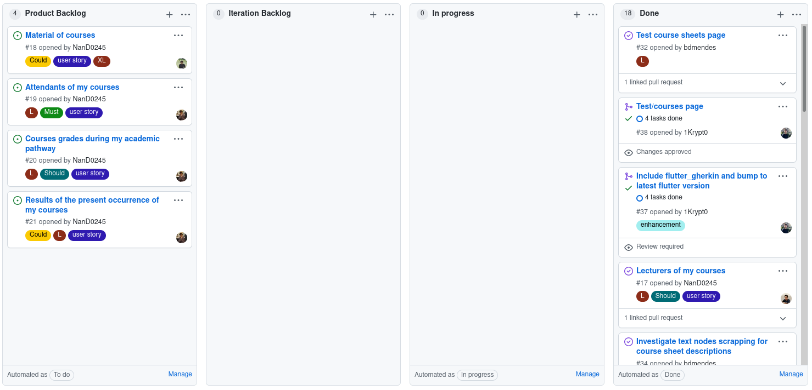

# Iteration 1 Retrospective

## Release Link

https://github.com/LEIC-ES-2021-22/3LEIC09T3/releases/tag/first-iteration

## Retrospective

### What went well?

We managed to **fully implement the expected user stories** addressing the contents and lecturers of each curricular unit. Furthermore, we managed to **integrate** said page **with the UNI app**, easing our work from now on.

Finally, as an added bonus, we **bumped the Flutter version** to the latest one, which **solved several dependency issues**, as was the case with the `flutter_gherkin` plugin.

### What should we do differently?

We should strive to **implement tests earlier** in the development process. We found it cumbersome to understand the technical challenges behind the likes of integration testing on the very last days of this sprint.

### What still puzzles us?

We are still not sure about the **need for a local database to cache course information** and allow for a higher performance and user experience quality. However, we should state that the aforementioned is **not relevant for a MVP release**.

## Project board at the end of the iteration

