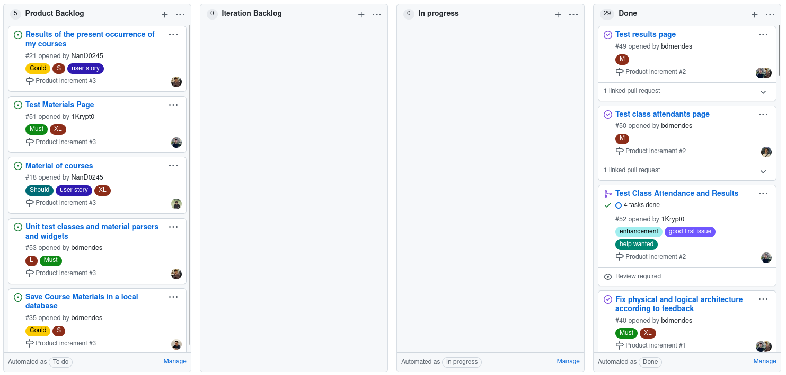

# Iteration 2 Retrospective

## Release Link

https://github.com/LEIC-ES-2021-22/3LEIC09T3/releases/tag/second-iteration

## Retrospective

### What went well?

We managed to **fully implement the expected user stories** addressing the user results and class attendants of each curricular unit, scrapped from current Sigarra information. In the class attendants page, particularly, we would like to point out that the user can easily contact their colleagues via email, by tapping the respective button next to their name.

### What should we do differently?

As discussed with the teacher, we **should use a develop branch** to hold unfinished features until they are ready to be shipped to the customer, as a whole, in the main branch. We'll add this step to our flow in the next iteration.

### What still puzzles us?

We found that it is useful for the user if the fetched information from Sigarra is stored on a local database, so that the UP servers are not overloaded and the class info (which does not change that regularly) is loaded to the user in a more timely fashion after the first fetch. We still have to think about the implementation details, i.e. **how many time to wait before fetching the data again** and whether to allow a manual force refresh (currently, the UNI app scrappes all data at its launch, which we would like to avoid for our scenario because of the aforementioned).

## Project board at the end of the iteration

