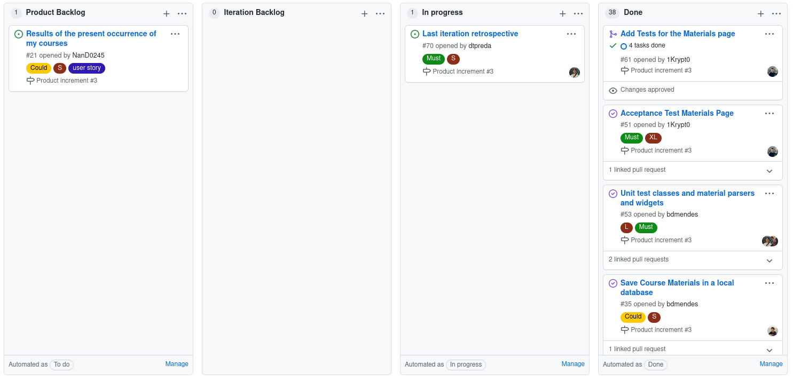

# Iteration 3 Retrospective

## Release Link

https://github.com/LEIC-ES-2021-22/3LEIC09T3/releases/tag/Third-iteration

## Retrospective

### What went well?

We managed to **fully implement data persistence and the materials page**. The data persistence allows us to store and **cache the course unit's contents** for a longer time period, which avoids unnecessary fetching of rarely changed contents. On the other hand, the materials page allows to **download**, in a user friendly format (a zipfile), **all of the course unit's content**.

### What should we do differently?

The integration tests implemented should be more in-depth, as aspects such as the fetching part of the process were not properly tested.

### What still puzzles us?

The flutter driver seems to have some unexpected race conditions that make some tests fail, seemingly at random.

## Project board at the end of the iteration

